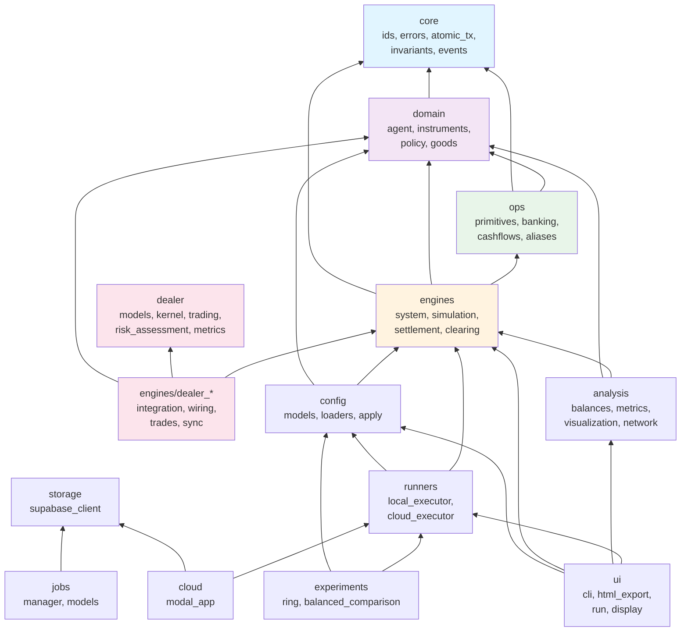
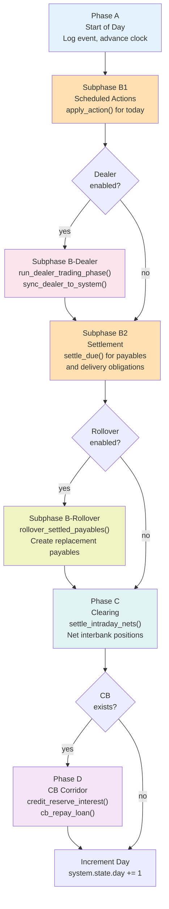
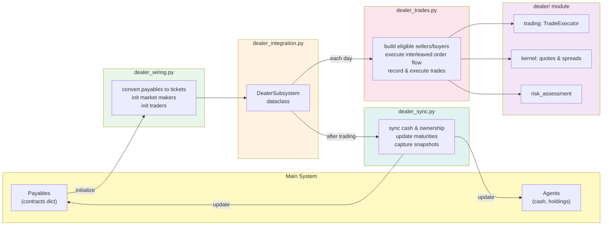
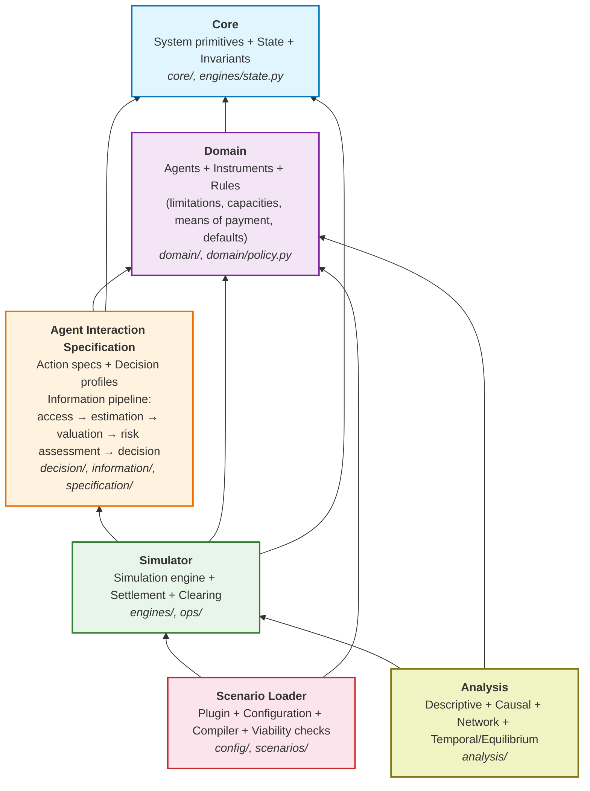

# Architecture

## Package Dependency Graph

Arrows point from dependent to dependency. Acyclic by design.

## Day Simulation Pipeline

Each simulation day follows this fixed phase sequence (see `engines/simulation.py:run_day`).

## Dealer Subsystem

The dealer subsystem bridges the main simulation (Payables) with a secondary market (Tickets).
Split across four modules in `engines/`:

## Target Architecture

This is the target architecture the codebase is being incrementally reorganized toward.
Each phase produces a fully working codebase — no big-bang rewrites.

### Package-to-Layer Mapping

| Current Package | Target Layer | Notes |
|---|---|---|
| `core/` | Core | Already correct |
| `domain/` | Domain | Already correct |
| `engines/state.py` | Core (State) | Extract from `engines/system.py` |
| `engines/system.py` | Simulator | After State extraction |
| `engines/simulation.py` | Simulator | Already correct |
| `engines/settlement.py` | Simulator | Default rules move to Domain |
| `decision/` | Agent Interaction | Already correct, gains `RiskAssessor` |
| `dealer/risk_assessment.py` | Agent Interaction | Move to `decision/risk_assessment.py` |
| `information/` | Agent Interaction | Wire into all agent decisions |
| `specification/` | Agent Interaction | Design-time validation tool |
| `config/` | Scenario Loader | Already correct |
| `scenarios/` | Scenario Loader | Gains viability checks |
| `analysis/` | Analysis | Expand with causal/network/temporal |
| `ops/` | Simulator | Already correct |
| `dealer/` | Simulator (secondary market) | Models + kernel stay, risk moves out |

### Migration Status

- [x] Phase 1: RiskAssessor extraction to `decision/` + architecture doc
- [ ] Phase 2: State extraction from `engines/system.py`
- [ ] Phase 3: Domain rules consolidation
- [ ] Phase 4: InformationService wiring into trader decisions
- [ ] Phase 5: Agent intention architecture
- [ ] Phase 6: Analysis expansion
